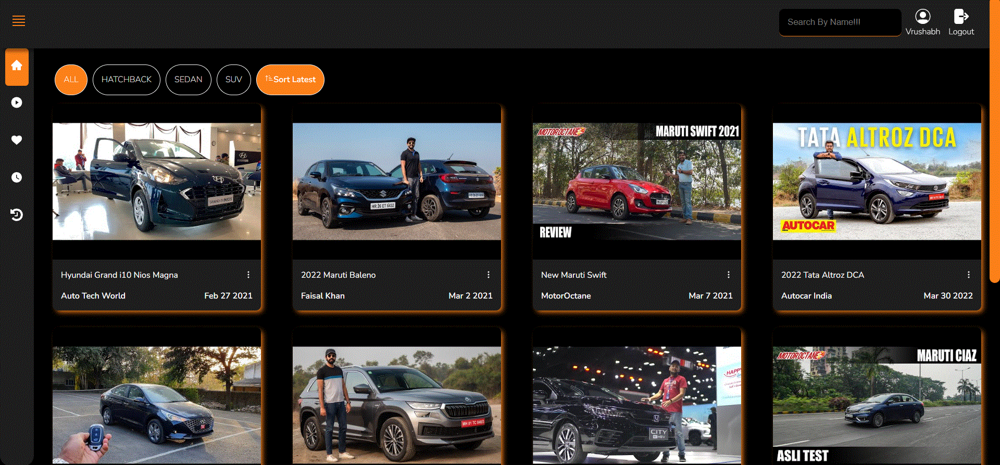

# CARS TUBE
## About
A Cars tube where users can see information about cars through a Video library.
## Tech Stack
- React, React Router v6
- Mock Backend
## Features
- Home Page
    - Display Videos
    - Users can create playlist for different videos 
- Single Video Page
    - Users can see the video
    - Video saved functionality
    - Add to watch later
    - Copy Video URL
    - Video Comment Section
- Watch Later
    - Add to watch later, delete from watch later.
- Video Playlist 
    - Create Playlist
    - Add Video to Playlist
    - Delete Playlist
    - Delete Video from Playlist
- Like Page 
    - Add Video to Like 
    - Delete Video From Like
- History Page
    - Users can save videos as history
    - Delete Video from History
-  Filters and Sort
    - Sort by different Cars Categories
    - Search Video by Cars Name
- JWT based Authentication
    - Log In
    - Sign Up
    - Log Out

